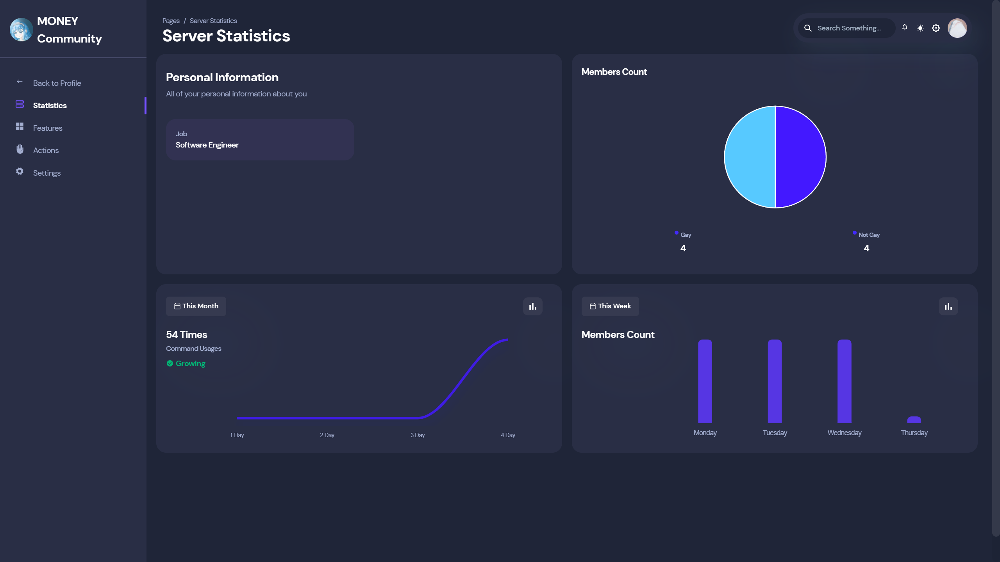

# D-Dash: Discord Bot Dashboard

A Full-Featured Dashboard Template for Discord Bots
<br>
You can modify `config/config.js` to edit configuration without touching the codes
<br>
Feel free to contribute this project

**Watch the Demo on [YouTube](https://youtu.be/Z90Ax-v4uH4)**

## Getting Started
**First, clone this Template**
```
git clone https://github.com/SonMooSans/discord-bot-dashboard.git
```

D-Dash is not just a Template, it supports to add **Feature** and **Action** in configuration
<br>
Therefore, it requires a full Backend Implementation.
<br>
For the implementation in Kotlin, See the [Example](https://github.com/SonMooSans/discord-bot-dashboard-backend)

You may implement your own Backend APi in another languages by implementing routes mentioned in its README

## Configuration
Go to the [config.js](src/config/config.js)
<br>
This configuration allows you to customize the UI, there is a `config.d.ts` for type annotations

### Normal Settings
You need to specify the API Url and invite url of your bot
<br>
You might also add footer items in configuration
```javascript
const config = {
    name: "Bot Name",
    footer: [
        {
            name: "Hello World",
            url: "https://github.com"
        }
    ],
    //API url
    serverUrl: "http://localhost:8080",
    //Invite url of your bot
    inviteUrl: "https://discord.com/api/oauth2/authorize?client_id=1004280473956139038&permissions=8&scope=bot",
}
```

### Display Data or Statistics
You can customize data to display in your dashboard.
<br>
Items function reads `detail` and `state`, then returns `DataItem` array which determines what to display

#### Dashboard Data
It is an Array of Dashboard Data Row, you can customize options of the row to get additional data from `state`
<br>
You can set `advanced` to true, so the dashboard will fetch `/guild/:guild/detail/advanced` and pass to the function by `advanced` of `state`

It will be displayed in **Statistics** Tab

#### Actions and Features Data
They are both Items functions, you must define data to returns in your API

It will be displayed in **Actions** or **Features** Tab
<br>
you can display the statistics of things like **Ranks**, **Reaction Role** 

```javascript
const config = {
    data: {
        dashboard: [
            {
                advanced: true,
                count: 3, //count of placeholders
                //advanced will be null if row.advanced is false
                items: (detail, {advanced}) => [
                    DataItem
                ]
            }
        ],
        actions: detail => [
            DataItem
        ],
        features: detail => [
            DataItem
        ]
    }
}
```

### Features and Actions
You must define bot features and actions in configuration
<br>
Also, the Features and Actions System must be implemented at your API

#### Feature
**Feature** is something that can be enabled or disabled, after enabling a feature.
<br>
User can edit its options and customize the behavior of bot

#### Action
**Action** contains multi **Tasks**, User can publish or delete Tasks
<br>
User must define some options before publishing a task

Action can be used for `Reaction Role` since you might want the Reaction Role can be enabled for multi messages

#### Options
Each Feature and Action requires an options array used to customize settings
<br>
When user updates options, server will receive a map of ids and its value

The **Options Function** will receive the `values` of feature/action fetched from server
<br>
For **Action**, values will be null before user publish the Task

```javascript
const config = {
    features: {
        "id_of_feature": {
            name: "Welcome Message",
            description: "Send a Mesage to welcome a member when they just joined the Server",
            options: (values) => [
                //Example option
                {
                    id: "message",
                    name: "Message",
                    description: "The message to be sent",
                    type: OptionTypes.Message_Create, //A Message/Embed Creator 
                    value: values? values.message : "",
                }
            ]
        }
    },
    actions: {
        "id_of_action": {
            name: "Reaction Role",
            description: "Give user a role when reacts to a Message",
            //values will be null before user publish the Task
            options: (values) => [
                //Example option
                {
                    id: "message",
                    name: "Message",
                    description: "The message to be sent",
                    type: OptionTypes.Message_Create, //A Message/Embed Creator 
                    value: values? values.message : "",
                },
            ]
        }
    }
}
```

### Multi Languages
Some fields support Multi Languages
<br>
You can see their type annotations to check about it

For those fields, you can use: 
```javascript
text = {
    zh: "Chinese",
    en: "English"
}
```

For now, we only supports **English (en)** or **Chinese (zh)**.
<br>
You can use `<Locale zh="Chinese" en="English" />` on some fields since they may supports `JSXElement`

## the Template of Template
This Dashboard is Based on [Horizon UI ⚡️](https://horizon-ui.com/horizon-ui-chakra)